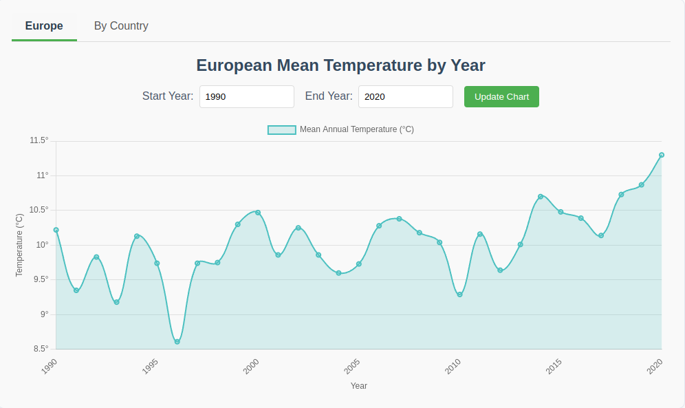
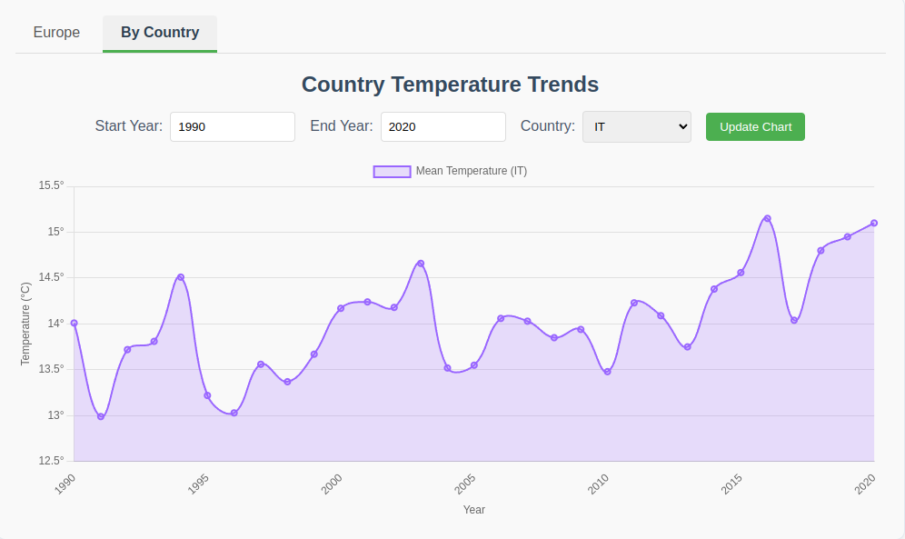
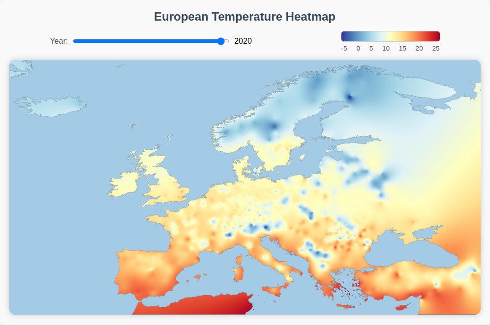

# Weather Data Visualization Project

## Overview
This project visualizes historical weather data across Europe using interactive maps and charts.  
The system provides:
- Temperature trend analysis for Europe and individual countries
- Identification of extreme temperature countries
- Heatmap visualization of temperature distribution

**Tech Stack**:
- Backend: Flask, SQLite, Pandas, NumPy
- Frontend: HTML/CSS, JavaScript (Chart.js, Leaflet.js)
- Data Processing: Meteostat API, Pandas, NumPy
- Visualization: Matplotlib (heatmap generation), Chart.js

---

## Repository Structure

```
├── backend
│   ├── app.py
│   ├── data_processor.py
│   ├── heatmap.py
│   ├── land_mask.py
│   ├── requirements.txt
│   └── data
│       ├── heatmaps
│       ├── scripts
│       ├── country-and-continent-codes-list-csv.csv
│       ├── europe_land_mask.npy
│       ├── weather_eu.db
│       └── weather_ru.db
├── frontend
│   ├── index.html
│   ├── js
│   │   ├── heatmap.js
│   │   └── main.js
│   └── styles.css
└── screenshots
```

Key Folders:
- `backend/`: Flask application and data processing
- `frontend/`: Interactive visualization dashboard
- `data/`: Contains all databases, preprocessed files and parsing scripts
- `screenshots/`: Example visualizations of the project

---

## Project Progress

### Data Collection & Processing
1. **Data Parsing**:
   - Collected monthly weather data for Europe using Meteostat API
   - Identified European countries using `country-and-continent-codes-list-csv.csv`
   - Stored processed data in SQLite database (`weather_eu.db`)
   - All parsing scripts available in `data/scripts/`

2. **Backend Implementation**:
   - Created REST API endpoints:
     - `/api/mean_temperature/<int:start_year>/<int:end_year>` - Europe-wide trends
     - `/api/country_temperature/<country>/<int:start_year>/<int:end_year>` - Country-specific trends
     - `/api/extreme_countries_temperatures/<int:start_year>/<int:end_year>` - Top/bottom 3 countries
     - `/api/countries` - List of available countries (EU only)
     - `/api/heatmap` - Pre-generated heatmap images
     - `/api/heatmap_data` - Raw heatmap data

3. **Core Data Processing**:
   ```python
   class TemperatureDataProcessor:
       # Main data access class
       def get_mean_temperature_by_year(start_year, end_year, country=None)  # Feature 1
       def get_extreme_countries_temperatures(start_year, end_year)  # Feature 2
       def get_countries_list(eu_only=False)  # Country list utility
       def get_heatmap_data()  # Raw heatmap data
   ```

### Implemented Features
| Feature | Description | Visualization | Implementation |
|---------|-------------|---------------|----------------|
| **Europe Temperature Trends** | Mean yearly temperature for Europe |  | Chart.js, `/api/mean_temperature` |
| **Country-Specific Trends** | Temperature trends for selected country |  | Chart.js, country endpoint |
| **Extreme Countries** | Top/bottom 3 countries by temperature |  | Chart.js, extreme endpoint |
| **Heatmap Visualization** | Temperature distribution across Europe |  | Matplotlib, RBF interpolation |

### Technical Highlights
- **Heatmap Generation**:
  - Uses Radial Basis Function (RBF) interpolation
  - Applies European land mask to exclude oceans/seas
  - Pre-rendered for performance (stored as PNGs)
  
- **Frontend Components**:
  - Interactive slider for the heatmap visualisation
  - Interactive year range selectors
  - Country dropdown with auto-complete
  - Responsive chart rendering

---

## Installation and Local Deployment

### Prerequisites
- Python 3.8+

### Backend Setup
```sh
git clone https://github.com/examplefirstaccount/dwv_project.git
cd dwv_project/backend

# Create and activate virtual environment
python -m venv venv
source venv/bin/activate   # MacOS/Linux
venv\Scripts\activate      # Windows

# Install dependencies
pip install -r requirements.txt

# Start Flask server
python src/app.py
```
API will be available at: http://127.0.0.1:5000/

### Frontend Setup
```sh
cd ../frontend

# Run development server
python -m http.server 8080
```
Access at: http://localhost:8080/
